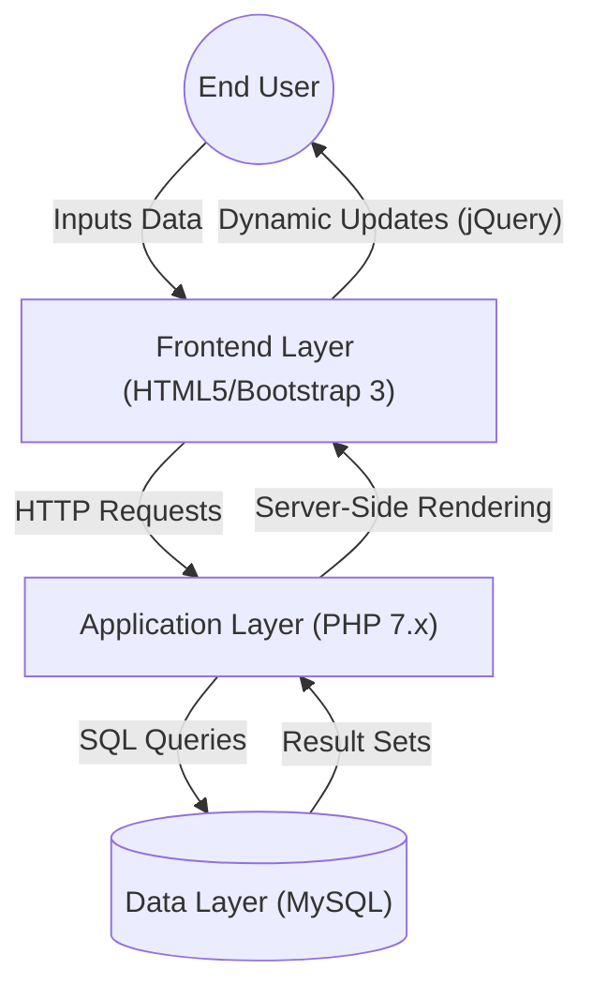

# Technical Specification: Car Rental System

## Architectural Overview

The **Car Rental System** is a web-based database management utility designed for the automation of vehicle rental operations. It utilizes a standard LAMP/WAMP stack architecture to facilitate seamless interactions between the frontend interface and the backend relational database.

### Data Lifecycle Diagram

---

## Technical Implementations

### 1. Backend Engine: PHP
The utility employs **PHP (Procedural)** as the core server-side scripting language to handle application logic and database connectivity.
-   **Session Management**: Implements PHP `$_SESSION` superglobals to maintain state across page views, ensuring secure access control for both Admin and User roles.
-   **Database Connectivity**: Utilizes `mysqli` or `PDO` (PHP Data Objects) for establishing secure connections to the MySQL database, executing CRUD operations for bookings and inventory.

### 2. Data Persistence: MySQL
All system data is standardized and persisted within a relational **MySQL** database (`carrental`).
-   **Normalization**: The schema is designed (up to 3NF) to minimize redundancy, with distinct tables for `tblusers`, `tblvehicles`, `tblbooking`, and `tblbrands`.
-   **Relational Integrity**: Foreign key constraints (e.g., linking `BrandID` in `tblvehicles` to `tblbrands`) maintain data consistency across the fleet inventory.

### 3. Frontend Visualization: Bootstrap & jQuery
The interface utilizes responsive design paradigms to ensure accessibility across devices.
-   **Bootstrap 3 Framework**: Provides a grid-based layout system for responsive rendering of car listings and administrative dashboards.
-   **Asynchronous Operations**: Uses **jQuery** for DOM manipulation and form validation, enhancing the user experience without requiring full page reloads for minor interactions.

### 4. Administrative Dashboard
To ensure comprehensive oversight, a dedicated admin panel provides synthesized views of system metrics.
-   **Visual Analytics**: Integrates **Chart.js** to render graphical representations of booking statistics and user registrations.
-   **Content Management**: Custom PHP logic allows for the dynamic updating of "Pages" (About Us, Privacy Policy) and handling of user testimonials directly from the secure backend.

---

## Technical Prerequisites

-   **Server**: Apache HTTP Server (via XAMPP/WAMP)
-   **Language**: PHP 7.x
-   **Database**: MySQL 5.x+
-   **Core Dependencies**: `Bootstrap 3` (CSS/JS), `jQuery`, `Font Awesome` (Icons), `Chart.js`.

---

*Technical Specification | Computer Engineering Project | Version 1.0*
